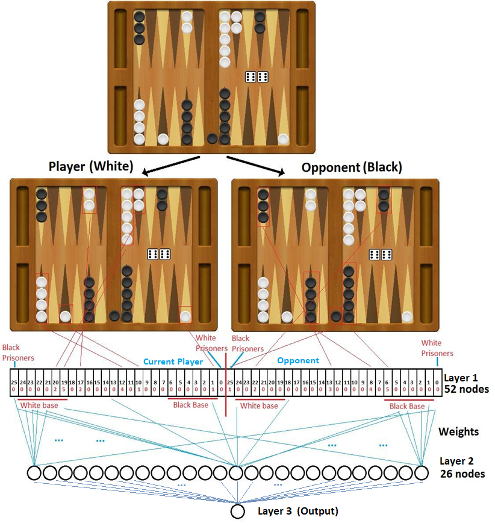
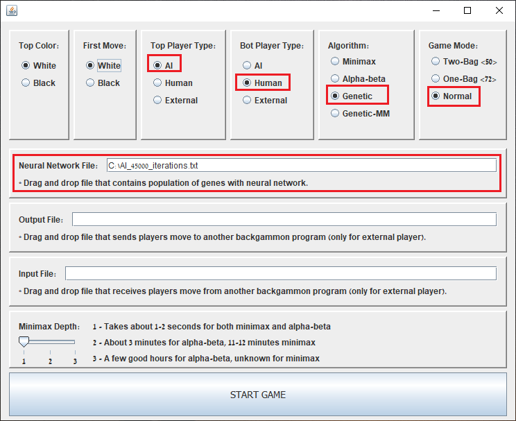
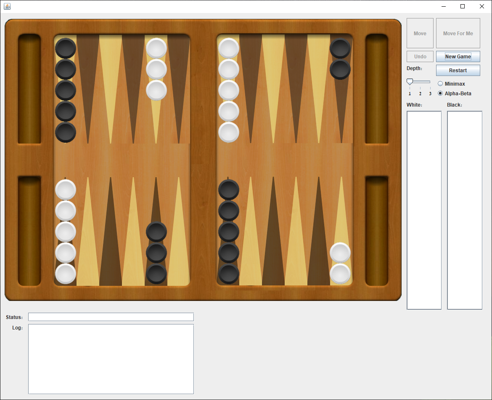

# Gengammon
Artificial intelligence trained by a genetic algorithm to play backgammon
 
The name "Gengammon" is formed by combining the words "genetic" and "backgammon" into one.
  
In this Hackathon project we present a supervised training method using genetic algorithm to train a neural network to play Backgammon. The neural network is trained to mimic moves played by professional backgammon players in real games (taken from an online database). The neural network simply rates how good a certain board is for the current player, a higher number being better. Thus, if the current player has rolled his die and has 18 possible ways to move his checkers into a new board state, the board state with the highest ranking will be the best move calculated by the neural network.

- [Introduction](#introduction)
- [Play Backgammon](#play)
- [Genetic Algorithm](#genetic-algorithm)
  * [Neural Network](#neural-network)
    + [Layers](#neural-network-layers)  
    + [Illustration](#neural-network-illustration)      
  * [Training Data](#training-data)
    + [Database](#database)  
    + [Data format](#data-format)  
    + [Training method](#training-method)      
  * [Data set](#data-set)
    + [Structure](#data-set-structure)  
    + [Filters](#data-set-filters)
      - [Homebound](#homebound-filter)    
      - [Contradicting](#contradicting-filter)   
      - [Unmovable](#unmovable-filter)      
  * [Gene](#gene)
  * [Fitness](#fitness)
    + [v.1](#fitness-v1)  
    + [v.2](#fitness-v2)  
    + [v.3](#fitness-v3)      
  * [Mutation](#mutation)
  * [Crossover](#crossover)
  * [Benchmarks](#benchmarks)

<h1>Neural network</h1>

The neural network is comprised of 3 layers.
  

The <b>first</b> layer is the input, consisting of 52 nodes, 26 nodes for each of the two players on the board, the current player and the opponent. Out of the 26 nodes allocated for each player, 24 of the 26 nodes represent the points on the board (1-24), and another 2 points represent the bar (checkers that have been “eaten” or “imprisoned” by the other side), one bar for each side, so for each side you can represent how checkers they have imprisoned, or have been eaten by the opponent. A number in each node represents the amount of checkers occupying the point, so 0 represents no checkers in this point, and 5 means there are five checkers of the corresponding side on that point.
  
The <b>second</b> layer is the hidden layer, it consists of 26 nodes that are connected to all input nodes. 
  
The third layer is simply 1 node that is the sum of all the hidden layer nodes.
  
A picture will illustrate this more clearly
  

  

<h1>Training Data</h1>

<b>Database</b>: The neural network is trained by learning from moves played by professional players. The database used for this project was obtained from the website http://itikawa.com/kifdb/herodb.cgi?table=bg 
 

The game files may be retrieved writing a script to download them (should be somewhere in repository).
 

<h2>Data Format</h2>
The database consists of several text formats for recording games, so it is necessary to parse each one differently, and then make sure that all moves are valid by backgammon game logic. An example of a file looks like this:
  

<pre>
Game 1
 michy : 0                             Thomas Low : 0
  1)                                   64: 24/18 13/9                    
  2) 21: 13/11 8/7*                    62: Bar/23 24/18*                 
  3) 61: Bar/24 13/7*                  64: Bar/15                        
  4) 54: 7/2* 6/2                      11: Bar/24 15/14* 6/5(2)          
  5) 52: Bar/23 6/1*                   51: Bar/24* 14/9                  
  6) 31: Bar/22 23/22                   Doubles => 2                     
  7)  Drops                             Wins 1 point
</pre>

<h2>Training Method</h2>
In the example above, “Thomas Low” was the first to move, rolled a 6-4, and moved one piece from point 24 to 18, and another piece from 13 to 9.
  
This single move can be used to train our neural network. If we look closely, Thomas, who was the first to move, rolled a 6-4 and had 14 different possible moves he could make (which would create a new board state). He chose his specific move which resulted in a new board state (after moving 24-18 and 13-9). The new board state is the result of Thomas choosing to move his pieces given the current board and die roll. The way we train our neural network is, given all 14 possible board states Thomas could have moved to, to rate the highest the state that Thomas chose.
  
In the game above, 10 moves were recorded total, 5 played by Thomas Low and another 5 by michy. With each of these moves we can create training data to train our neural network. For each move made by a player, there is the “initial board state”, when it is the start of the players turn and he has not moved yet but rolled his dice, and the “chosen board state” which is the new board state after the player has moved. Thus, this way we can create thousands of training tests, with each test being a unique move played by a professional. 
  
The way to train our neural network is, given an initial board state and die roll that a professional player has played, generate all possible board states (from all possible moves) and train the neural network to rate the board state chosen by the professional player the highest (“chosen board state”). The fitness function in our genetic algorithm does just that – approximates how good of a job a neural network (gene) does at rating the moves of professional players the highest from the other possible moves that could have been chosen (more details about the fitness function later).
  

<h1>Data Set (Training set)</h1>

The data set consists of many “tests”. A test is comprised of 4 components:
1.	<b>Initial board state:</b> The state of the board before the professional player moved.
2.	<b>Chosen board state:</b> The state of the board after the professional player has moved.
3.	<b>Die:</b> The die the player rolled.
4.	<b>Color:</b> The color of the current players turn.

For each test, given the initial board and die, we may generate all possible board moves. We can rank them by feeding them to our neural network, which outputs a number for each board state (that has been moved to from the initial board state and die). We want our neural network to rank the possible board states so that the chosen board state of the professional is ranked highest from the other possible board states.
The data set is created by parsing all game files recording professional player games. For every move made in a game, it is possible to create a single “test” in the data set as mentioned above. Each one of these “tests” helps our neural network (gene) mimic the moves of professional players, and in turn play like one. This way we can create thousands of test sets, each test set being a unique move played by a professional.
  

<h2>Data Set Filters</h2>
Some improvements were made to the data set, which were mainly filtering out data that was not needed.
  

<b>Homebound Filter:</b> Not all moves played by professionals in games are included in the data set for the neural networks to learn from. We filter out all moves that are made after both players are homebound, meaning that both players have passed each other and it is simply a race to the finish, without any strategy to win, so it would be a waste of resources to train the networks with such data. A simple code was created for the AI to use once it is homebound (it does not rely on the neural network anymore). 
 
Filtering out these moves (after homebound) made our network learn faster and much more accurately, with an increase from 88% to 95% in gene fitness (100% fitness means the neural network mimics all moves in the data set like the professional players move). More specific details do not exist since we did not record the exact improvements, but this was one of our main improvements to speeding up learning and improving accuracy. 
  

<b>Contradicting Move Filter:</b> Furthermore, we also filtered out all tests that were had moves that were chosen differently by different professional players - that had the same initial board state and die roll, but different chosen board state. This means that different professional players were in the same state but chose to move differently. We arbitrarily kept one of the tests and discarded the other tests. It would be impossible to achieve 100% accuracy otherwise.
  

<b>Unmovable Plays Filter:</b> Another simple data set filter that we have not yet implemented is filtering out all tests that comprise of moves that are unmovable, that means that the initial board and chosen board are the same (this only happens if the player has an imprisoned checker and cannot enter the opponents base), since it takes up CPU time and does not make a difference to the training.
  

<h1>Gene</h1> 
A Gene is a single neural network. The neural networks weights are randomized completely when a gene is created.

<h1>Fitness</h1>
The fitness function in our genetic algorithm approximates how good of a job a neural network (gene) does at rating the moves of professional players the highest from the other possible moves that could have been chosen. There are different ways to calculate the fitness. We will present the different methods that were used and how they were improved.
  

<h2>Version 1</h2> 
The first fitness function was calculated by comparing the chosen board rating (move chosen by professional player) to the lowest and highest rating of all possible board states. For example, given an initial board state that has, for example, 16 different possible moves (one of them is the move chosen by the professional), then we feed all of them through the neural network and get their rating. We then find the MINIMUM_RATING rating given for one of the moves, the MAXIMUM_RATING rating given and PROFESSIONAL_RATING – the rating the neural network gave the move the professional player played. We then use the formula:
  
<b>| PROFESSIONAL_RATING - MINIMUM_RATING| / |MAXIMUM_RATING - MINIMUM_RATING|</b>
  
This formula normalizes the genetic fitness rating to a value between <b>[0,1]</b>.
 
A genetic fitness score of 0 means the professional move was rated the lowest by the gene (neural network), while a value of 1 means the professional move was rated the highest.
  
This formula had its problems, since it did not take into consideration the <b>ranking</b> of the professional move compared to others but <b>only the rating</b>. To demonstrate, assume that there are 16 possible moves. Let’s assume that the lowest rating was 0, and the highest rating was 1000. Now let’s assume that the professional players move had a rating of 990. According to the formula above, the fitness function will rate the neural network with a score of 0.99 = (990-0)/(1000-0), which is very good, almost the highest rating! 
  
However, what happens if the rest of the 13 possible moves are rated with scores (by the neural network) between 991 to 999? That means that there are 14 total moves that are <b>ranked higher</b> than the professional players move, making it the <b>second lowest ranked move</b>. This means that the neural network is doing a bad job at rating our professional players move, and yet the fitness function gave it a high fitness score of 0.99 (99%). Thus, this fitness function had to be changed to be able to estimate how well a neural network does at <b>ranking</b> a professional players move in comparison to other possible moves.
  

<h2>Version 2</h2> 
A new fitness function was formulated that will score the neural networks based on how well they ranked the professional players moves. The new fitness function checks what rating the neural network gave for each possible move, and finds how high the professional player move ranked. The formula is:
 
<b>(TOTAL_MOVES – RANK_PROFESSIONAL) / (TOTAL_MOVES – 1)</b>
 
This formula normalizes the genetic fitness score to a value between <b>[0,1]</b>. 
  
A fitness score of 0 means the professional move was <b>ranked</b> last by the gene (neural network), while a value of 1 means the professional move was <b>ranked</b> first.
  
For example, if there are 16 possible moves, and the neural network ranked the professional players move with the 3rd highest rating, then the genetic function will give that neural network a score of <b>0.8666</b> = (16-3)/(16-1)
  
This new fitness function that relied on ranking was better than the former, but there was still room to improve. There was a problem with measuring small improvements in a neural network since the fitness function could not calculate small increments of improvements, the smallest increment in score is a fraction of the total number of possible moves.
  
For example, if our neural network currently ranks a professional players move as 3rd best from a total of 16 possible moves, then the fitness function will score that neural network a score of <b>0.8666</b>. In order for the score of the fitness function to improve, the neural network would have to change in such a way that the ranking of the professional move would be ranked 2nd,  in which case the fitness function would rate the neural network <b>0.9333</b> = (16-2)(16-1), an increase of 1/15=<b>0.0666</b> (the reason its 15 and not 16 like the number of possible moves is so that it would be possible to normalize fitness score between <b>[0,1]</b>). The fitness function is not capable in this case of increasing the score of the neural network in increments smaller than 0.0666. 
  
This is problematic since this fitness function cannot measure if a gene has improved a little, thus it does not rank a gene that might be closer to achieving 2nd rank for a professional player move a better score.
  

<h2>Version 3</h2> 
A new fitness function needed to be formulated to be able to measure small improvements a neural network has made that ranks a professional players move closer to rank 1. Suppose a neural network currently ranks a professional move 3rd, and in the next generation the gene has been mutated, it still ranks the professional move as 3rd, but is “closer” to ranking it as 2nd, then the gene has improved and thus should have a higher fitness score.
  
It is important to note that these small increments in fitness score should not overpass the ranking score of the next best rank. For example, if there are 16 possible moves, and a neural network has ranked a professional player move as 3rd best, the fitness function will score that neural network 0.8666. If the neural network ranks it 2nd best, the fitness score will be 0.9333. This means that as long as the neural network ranks a professional player move as 3rd best, any improvements the neural network makes should not improve its fitness score by more than 0.9333, since the score must represent how well the neural network ranks, otherwise we will have the same problem as in the first version of the fitness function. In other words, in this example, if the neural network ranks the professional players move 3rd best (with 16 possible moves), the fitness function must score that neural network between [0.8666, 0.9333).
  
From the above it is concluded that the current formula needs to be changed to accumulate for small improvements in the neural networks ranking of the professional players moves, for a way to measure if the neural network is getting “closer” to ranking the professional players move a higher rank.
  
The “secondary score” (small increment in fitness score) is calculated by taking the distance of the neural network rating for the professional players move and the score of the move currently ranked 1st place by the neural network, divided by the number of possible moves and the max rating (move ranked 1st). For example, if the rating of the professionals move is 100, and the first ranked move is 120 (with 16 possible moves), then our secondary score will be (120- 100) / (16*120). We must divide by the amount of moves and highest score so that secondary score does not change the fitness score to a higher rank. For example, if the professional players move is ranked 3rd, then the neural nets fitness score would be (0.8666 + secondary score) < 0.9333.
 
<b>The secondary score is important, and was one of the main improvements in training.</b>
  

<h1>Mutation</h1>
The mutation that worked best was swap mutation, where we pick 2 random weights in the hidden layer and swap them. This mutation was far superior to our binary swapper, where we would pick a random weight and simply change a single bit. Even changing more than 1 bit did not yield such good results (it worked, but was very slow).
  

<h1>Crossover</h1>
The crossover performed by merging a uniform amount of weights from 2 parents into 1 offspring. This crossover is by far superior the first crossover we tried, which consisted of taking a uniform amount of bits for each weight from 2 parents. <b>This was our biggest improvement in the genetic algorithm</b>, it was very pleasant to see the speed up improvement. It is worth noting that once convergence started slowing down (usually at 94%), we could switch between the crossovers after every amount of iterations. We are not sure if it was better this way or not.
  

<h1>Benchmarks</h1>
We did not have enough time to test our program against other AI’s, however we played them against ourselves (humans) and a heuristic function that we created last semester for minimax.
  
The neural network is able to defeat us human players, with a ratio of over 40%. It plays well, but sometimes it chooses very weird moves (especially when having the possibility to capture one of the opponents pieces, it will do so sometimes carelessly, we are not sure why). It won our minimax heuristic 53%.
  
Furthermore, we tested different trained network against each other, with these results:
  
*A total of 50000 games played against each other.
 

| Data set size  | Time training  | 45000  | 30000  |  1500 |  Random |
|---|---|---|---|---|---|
|  45000 | 20 hours  | ---  | 57%  |  67% |  99.9% |
|  30000 | 20 hours  | 43%  | ---  | 60%  |  99.8% |
| 1500  |  10 minutes | 33%  | 40%  | ---  | 95.5%  |
| Random choice  |  --- |  0.01% | 0.02%  | 4.5%  | ---  |

  
 
The games are not played until the end. We simply play until both players are homebound, and after that there is reason to continue the game simulation, since we can count how far each of the side checkers are from being beared off (removed from the board) as a metric to who is the winner. We also take into consideration who plays the next move when using this metric, and since the average dice roll in backgammon equals will advance checker units by 8.166 points, we add that number to the side who is to roll next.
  
<b>Home Bound Metric:</b> Using this sort of calculation, we came up with a new benchmark to see how well a neural network fares against another, we simply count the distance of the checkers after both players are homebound, just as mentioned above, but we don’t output a simple “win” or “lose”, but the difference between the distances. So a neural network that played against another network for 50000 games, and the overall output is “2.34”, this means that this neural network is better because it had a lead of 2.34 points on average for every game. This metric is <b>much more accurate</b> than the “won or lose” metric, since it can actually show you by how much a neural network is better instead of wins and losses, and usually for 2 networks that are very similar the “win or lose” is less accurate than this metric.
 
We will call this metric the <b>Home Bound</b> metric.
  

<h1>Future Possibilities</h1>

<b>Unsupervised learning:</b> It is possible (not yet tested) to train a network without supervision by creating its own data set using the Home Bound metric. The tests are created by letting the network (which is completely random and a bad player at first) play against itself. Thus we can create the 3 components of the tests: initial board, dice and color. What we have left is the “chosen board”. To choose the “chosen board”, we let the network play against itself for let’s say 1000 times, for every possible board move.
The board move that achieved the highest home bound metric will be chosen as the “chosen move”.
  
After creating a data set, we train our neural network by it. After the network has been trained, we repeat the process. We create a new data set (reevaluate the chosen moves by playing the new network against itself).
  

<b>Conclusions:</b>
Working on this project has been a lot of fun. We chose genetic algorithm as our trainer in order to see how well it could train a neural network. We hope to train a network using backpropagation and see the differences. This method proved itself promising, and we are sure there are many improvements that can be made to make the neural network play much better. 

  
<h1>How To Play</h1>
The GUI and backgammon code used for this project was taken from another project, so when you run the game you will see options unrelated to playing against the AI developed in this project using genetic algorithm. Below is a step by step guide how to play vs the AI developed by this project.
  
Run the <b>backgammon.jar</b> file
The game setting window will open, it should look like this:
  

  

Highlighted in red boxes are the settings that you need to make sure are correct to play against the AI.
 
<b>Game Mode:</b> Choose <b>"Normal"</b> - IMPORTANT! (the other 2 choices are non relevant are for another project). Normal means normal die rolls.
 
<b>Algorithm:</b> Choose <b>"Genetic"</b> to play against AI that was trained with genetic algorithm. 
 
    If you wish to, you can choose to play against an AI that works with minimax by choosing either "Minimax" or "Alpha-beta" (better option)
 
<b>Bot Player Type/Top Player Type:</b> Make sure that one of these is <b>"AI"</b> and the other <b>"Human"</b> so you can play against the AI.
 
<b>Top Color:</b> For personal preference, the top player (base point 18-24) will be this color.
 
<b>First Move:</b> Which player color moves first.
 
<b>Neural Network File:</b> File destination of neural network saved on file. In the repository there are 2 such files, "AI_30000_iterations.txt" and "AI_45000_iterations.txt". Download them and drag them into the box.
  
Press <b>"START GAME"</b> to run the game. A game window will pop up.
  

  
<b>New Game:</b> Start a new game.
 
<b>Restart:</b> Stops current game and starts a new one.
 
<b>Move:</b> After you have moved all your checkers, press this to play your move.
 
<b>Undo:</b> If its your move and you have moved checkers but havn't played yet (by pressing the "Move" button) you can press "Undo" to undo the last checker you moved.
 
<b>Move For Me:</b> The AI will play for you.
  

In the Log box you can see the move history.
  
Enjoy!

